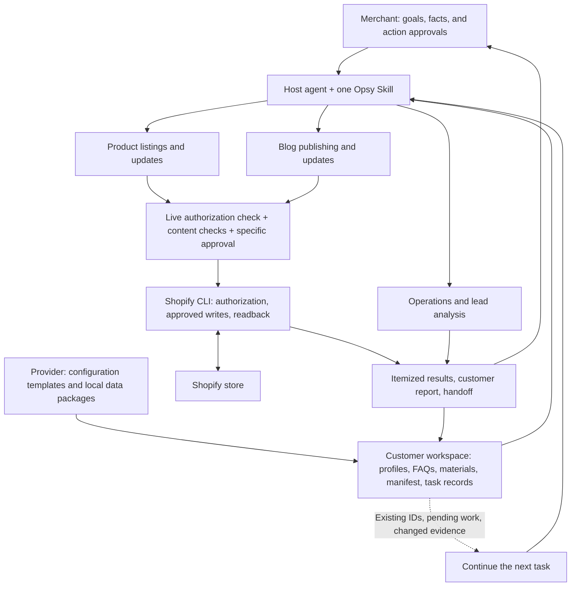
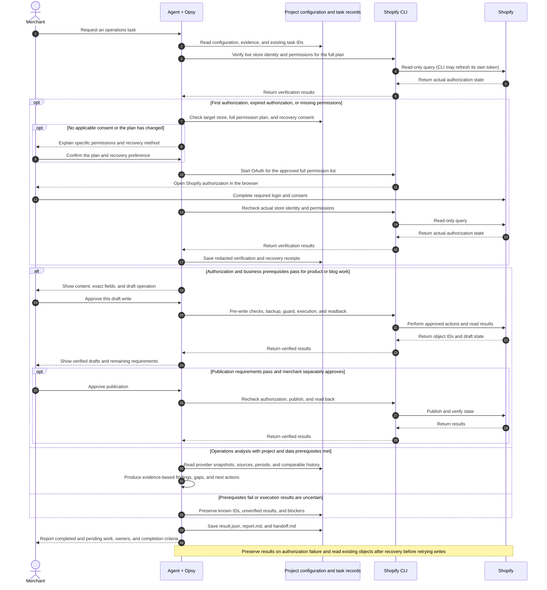

<p align="center">
  <picture>
    <source media="(prefers-color-scheme: dark)" srcset="docs/assets/brand/grc-logo-dark.svg">
    <source media="(prefers-color-scheme: light)" srcset="docs/assets/brand/grc-logo-light.svg">
    
  </picture>
</p>

# Opsy — Guided Shopify Operations

**English** · [简体中文 (ZH)](README.zh-CN.md)

**One agent Skill, project configuration, and provider-delivered data packages for product listings, blog publishing, and operations analysis.**

Opsy serves **B2B Shopify stores** focused on inquiries, quotations, and business contact. It works with Codex and WorkBuddy. Merchants describe their goals in natural language, confirm business facts, and approve specific actions. The agent follows Opsy's rules and scripts, saves the results, and carries context into the next task.

Shopify operations run directly through **Shopify CLI**. Opsy does not require the official Shopify plugin, an MCP server, or another operations Skill. It still requires a host agent, Node.js, Shopify CLI, and store authorization. Merchant information stays in the merchant's own project.

[Merchant overview](docs/opsy-core-purpose.md) · [Customer handover guide](docs/opsy-customer-handover-sop.md) · [Changelog](CHANGELOG.md) · [Authorization and recovery](skills/opsy/references/authorization-lifecycle.md) · [Results and handoff](skills/opsy/references/result-handoff-contract.md)

Supporting guides and reference documents are currently primarily in Chinese.

Customer delivery includes **the Opsy Skill folder or GitHub repository, a prepared customer project ZIP, and guided installation**. The provider completes the [one-page delivery card](docs/templates/customer-handover/%E5%AE%A2%E6%88%B7%E4%BA%A4%E4%BB%98%E5%8D%A1.md). The customer follows the [getting-started guide](docs/opsy-customer-handover-sop.md) to configure Codex or WorkBuddy and open the project, without completing multiple handover forms.

## Three core workflows

| Workflow | Inputs | Actions and deliverables |
| --- | --- | --- |
| **Product listings and updates** | Product specifications, images, sales materials, and confirmed profiles; search data is optional | Prepare product candidates, confirm the audience and target page, and draft titles, descriptions, SEO fields, and inquiry prompts. Write approved content, read it back, and deliver object IDs, preview links, and a list of missing information. |
| **Blog publishing and updates** | Profiles, product knowledge, FAQs, assets, and provider-delivered local data | Evaluate topics; prepare articles, FAQs, product links, images, and CTAs. Generate local previews, create approved drafts, verify and publish with approval, and deliver results with evidence. |
| **Operations and lead analysis** | Provider-delivered data packages, a manifest, and agreed inquiry measurement definitions | Analyze search, pages, channels, and available inquiry data. Compare historical periods when definitions are compatible, and deliver evidence, gaps, findings, and next actions. |

Product work can start with confirmed merchant materials. Blog work prioritizes valid local GSC and GA4 data. New stores can start with a valid empty data center and accepted FAQ questions, without inventing search metrics. A click or contact intent is not a qualified inquiry; actual inquiries and lead quality require sales feedback.

Products support a minimum-input workflow: once core facts and safety checks pass, create a non-public draft and preview it in Shopify admin. Missing SEO fields, images, or values for existing metafields remain on the checklist and must be addressed before publication. Current variant writes cover SKU and price for a single variant; arbitrary bulk editing across multiple variants is not promised. Image uploads and blog SEO writes also require specific approval and readback verification.

## Configuration for SEO and GEO

Provider setup and handover follow the [customer project configuration standard](skills/opsy/references/client-config-standard.md). New projects contain six configuration files, including the question-library CSV, and 11 workspace templates. **`buyer_faq.json` and `content_voice.json` are shared by product and blog workflows**, providing answer evidence and writing rules. The standalone voice file takes precedence; legacy profile voice settings are used only when that file is absent. Invalid configuration does not trigger a fallback. Inspect configuration with the read-only command `node skills/opsy/scripts/opsy.mjs list-configs --json`. Review differences in existing configuration without overwriting customer values.

The three workflows perform the work. Their configuration determines the audience, priorities, content destination, and basis for review.

| Supporting capability | Purpose |
| --- | --- |
| Business and buyer profiles | Confirm the business model, audience, markets, languages, purchasing concerns, seller voice, and inquiry entry points. |
| FAQs and business evidence | Preserve question sources, objections, and whether answers are eligible for use. Search demand must not be presented as product fact. |
| Data configuration | Declare files, sources, periods, and timezones. Mark missing metrics as unavailable and check comparability before historical analysis. |
| Topic evaluation and page selection | Generate candidates from data, FAQs, or merchant materials, then confirm the topic, target page, and audience card before writing. |
| Content and publication checks | Check facts, buyer value, SEO fields, internal links, media, and CTAs. Execute and verify the approved set of actions. |

“Topic scoring” currently means **an evidence-backed candidate queue, prioritization, and customer confirmation**. There is no separate numeric keyword-difficulty or opportunity-score engine. SEO and GEO aim to answer real questions with clear, traceable facts. Publishing does not prove improved rankings, traffic, or AI citations; those outcomes require later data.

Previously confirmed publication channels, blogs, markets, languages, and metafield definitions from site setup can be reused. FAQ preparation, business profiles, weekly priorities, and 404 handling are supporting entry points using the same workspace and execution rules.

## How it works

### Architecture and data flow

The flow below covers the three core workflows, authorization checks, approved writes, results, and task continuation. The detailed component and configuration overview is also available in Chinese: [SVG](docs/diagrams/09-opsy-skill-config-dataflow.svg) · [PNG](docs/diagrams/09-opsy-skill-config-dataflow.png) · [PlantUML source](docs/diagrams/09-opsy-skill-config-dataflow.puml).



Analysis consumes local snapshots delivered by the provider and does not use Google OAuth. All three workflows remain subject to the current project state. Before connecting the store, complete the permitted profile, FAQ, connection, and workspace preparation. Shopify CLI manages authorization; Opsy stores only permission and verification metadata.

### Sequence: authorization, execution, recovery, and handoff



This is the typical flow for new products and articles. Updates also require approval for the specific changes and subsequent verification. Network failures, rate limits, and permission denials are reported separately; they do not automatically trigger repeated token recovery. The Mermaid diagrams render on GitHub and in compatible Markdown readers. See the [diagram directory](docs/diagrams/README.md) for more. This page and the Skill's references define the current workflow.

## First use and authorization recovery

Open the customer project in Codex or WorkBuddy and enter:

```text
Use $opsy to inspect this project and preview the operations workspace plan.
```

1. **Locate the workspace.** Read `shopify-ops.json` and preserve existing directories and `AGENTS.md`. Preview new workspaces before initialization.
2. **Confirm the store and permissions.** Present the complete permission plan for products, blogs, publication channels, and media. After customer confirmation, complete browser authorization and choose whether Opsy may initiate future recovery for that same plan.
3. **Verify and configure.** Verify the actual store and granted permissions, then complete profiles, roles, voice, and business-object configuration.
4. **Run tasks.** Confirm topics and content, approve specific actions, verify results, and save the handoff. Resume using existing IDs and updated evidence.

| State | Available actions |
| --- | --- |
| Workspace not initialized | Inspect the project and preview the workspace plan. |
| Store connection incomplete | Complete the business profile questionnaire, organize FAQs, follow connection guidance, and check the workspace. |
| Initial profile incomplete | Perform the reads and confirmations needed to complete the profile; organize FAQs. |
| Live authorization not verified or recovery required | Preserve tasks and local materials while checking authorization. Shopify writes remain paused. |
| Ready for operations writes | Use the six-item menu; each write still requires its own capabilities and approvals. |

The default plan includes eight read/write scopes covering products, content, publications, and files. Permissions for 404 handling and extended profiling are added when needed. Changes to the plan require new confirmation. **Authorization consent is separate from approval to create drafts or publish.**

The ordinary `status` command checks local configuration only and cannot prove token validity. Runtime entry points perform live checks. Expired authorization or missing permissions use the confirmed full plan for recovery, followed by another permission check. Recovery has a single-attempt limit, timeout, workspace concurrency lock, and failure cooldown. A person must still complete browser login and consent. See the [authorization lifecycle](skills/opsy/references/authorization-lifecycle.md).

## Results and handoff

Every product, blog, or data task keeps its own records, including partial and blocked runs:

```text
outputs/runs/<task_id>/<run_id>/
  result.json   Item-level state, object IDs, inputs, and verification evidence
  report.md     Customer-facing results
  handoff.md    Pending work, owners, completion criteria, and continuation context
```

Reports distinguish local preparation, Shopify drafts, published content, and results awaiting verification. A successful command exit does not prove publication. Earlier records are preserved; subsequent tasks reuse object IDs and check for changed inputs. Authorization interruption receipts live in `outputs/authorization/`, without tokens, cookies, or raw OAuth output.

## Installation and updates

Requirements: Node.js ≥ 22.12, npm or another Node package manager, Git ≥ 2.28, and Shopify CLI. The repository's declared toolchain baseline remains CLI **4.5.2** / Admin GraphQL **2026-07**. The authorization upgrade was checked against local CLI **4.7.1**. Compatibility of that flow with 4.5.2 and real-store OAuth still requires live verification; see the [authorization upgrade handoff](docs/handoffs/2026-09-13-opsy-cli-authorization-handoff.md).

Clone the repository or extract a release, then run the installer from the repository root. It detects supported hosts automatically, or you can select `Codex`, `WorkBuddy`, or both.

**Windows:**

```powershell
.\install.ps1 -Host Both -DryRun
.\install.ps1 -Host Both
```

**macOS / Linux:**

```bash
./install.sh --host both --dry-run
./install.sh --host both
```

To update, obtain the desired repository version or release and rerun the installer. It displays a plan, asks for confirmation before changes, and archives the previous Skill before installation. Customer profiles, materials, data, and results remain in their workspace.

**Updating source within the same version:** the current work remains under `0.1.0 / Unreleased`, so a regular install may report `up-to-date`. Use `Force` explicitly to replace an installed copy with reviewed source at the same version:

```powershell
.\install.ps1 -Host Both -Force -DryRun
.\install.ps1 -Host Both -Force
```

```bash
./install.sh --host both --force --dry-run
./install.sh --host both --force
```

Reload Opsy in the host after updating, then run `$opsy` in the customer project to check state and existing tasks. These commands install the Opsy Skill; they do not install Node.js or Shopify CLI, or automatically authorize a store. See the [changelog](CHANGELOG.md) for version changes.

On Windows, the helper switches interactive Chinese terminals to UTF-8 and uses ASCII escapes in JSON output. If human-readable output is still garbled, run `chcp 65001` first.

## Customer projects and repository structure

The Skill holds reusable methods; the customer project holds business context. They are maintained separately.

| Customer file or directory | Purpose |
| --- | --- |
| Project-root `shopify-ops.json` | Locate the operations workspace; existing `_project/` layouts can be retained. |
| Workspace `config/store-profile.json` | Business, buyers, language, inquiry entry points, and authorization verification metadata; supports legacy embedded voice settings. |
| Workspace `config/buyer_faq.json` | Questions, objections, sources, and answer eligibility. |
| Workspace `config/content_voice.json` | Shared seller role, expertise, voice, required practices, and prohibited expressions for products and blogs. |
| Workspace `data-center/manifest.json` | Declare provider-delivered local data packages, sources, periods, and timezones. |
| Workspace `inbox/`, `outputs/`, `backups/`, `ai-log/` | Inputs, deliverables, pre-write backups, and operation records. |

New projects default to `shopify-ops/`. Existing locator files, rules, and directories take precedence. The Skill is never copied into the customer workspace. See the [project file inventory](docs/opsy-project-file-inventory.md).

```text
README.md          English overview (default)
README.zh-CN.md    Simplified Chinese overview
skills/opsy/       The only distributable Skill: rules, references, templates, Node scripts
tests/             State, authorization, data, write, and handoff tests
scripts/           Repository validation
docs/              Merchant guides, diagrams, audits, development handoffs, and brand assets
VERSION            Current version
opsy-release.json  Release and toolchain metadata
CHANGELOG.md        Change history
install.*          Installation and updates for both hosts
uninstall.*        Uninstall by recoverable archiving
```

## Scope and verification status

Opsy supports `b2b_inquiry`. Checkout-led DTC stores should use the separate Opsy DTC package. A provider operations suite can deliver reviewed tasks through a local handoff format. It is an optional upstream source; the three core workflows, reporting, and handoff do not require another Skill.

Business profiling is limited to the business questionnaire. Technical tracking, Core Web Vitals, structured data, themes, and site-wide technical audits belong to separate implementation workflows. Merchants do not configure Google APIs. Existing metafields may be populated according to their definitions; Opsy does not create definitions without authorization.

The 2026-09-13 (Asia/Shanghai) development record reports **139/139 tests passing**, with repository, Skill, script syntax, and both-host installer dry-runs passing. These tests include synthetic authorization failures and recovery scenarios. They do not constitute real-store acceptance testing for OAuth, image uploads, or end-to-end publication. See the [core repair handoff](docs/handoffs/2026-09-13-opsy-core-repair-handoff.md) and [authorization upgrade handoff](docs/handoffs/2026-09-13-opsy-cli-authorization-handoff.md).

The authorization implementation was checked against Shopify's official [store auth](https://shopify.dev/docs/api/shopify-cli/store/store-auth) and [current app installation query](https://shopify.dev/docs/api/admin-graphql/latest/queries/currentappinstallation) documentation. Runtime rules live in [SKILL.md](skills/opsy/SKILL.md) and its direct references. Verify the operation contract for the selected API version before real writes.

## Uninstall

```powershell
.\uninstall.ps1 -Host Both
```

```bash
./uninstall.sh --host both
```

Uninstall archives the shared `opsy` Skill. It does not scan or remove customer operations workspaces.
