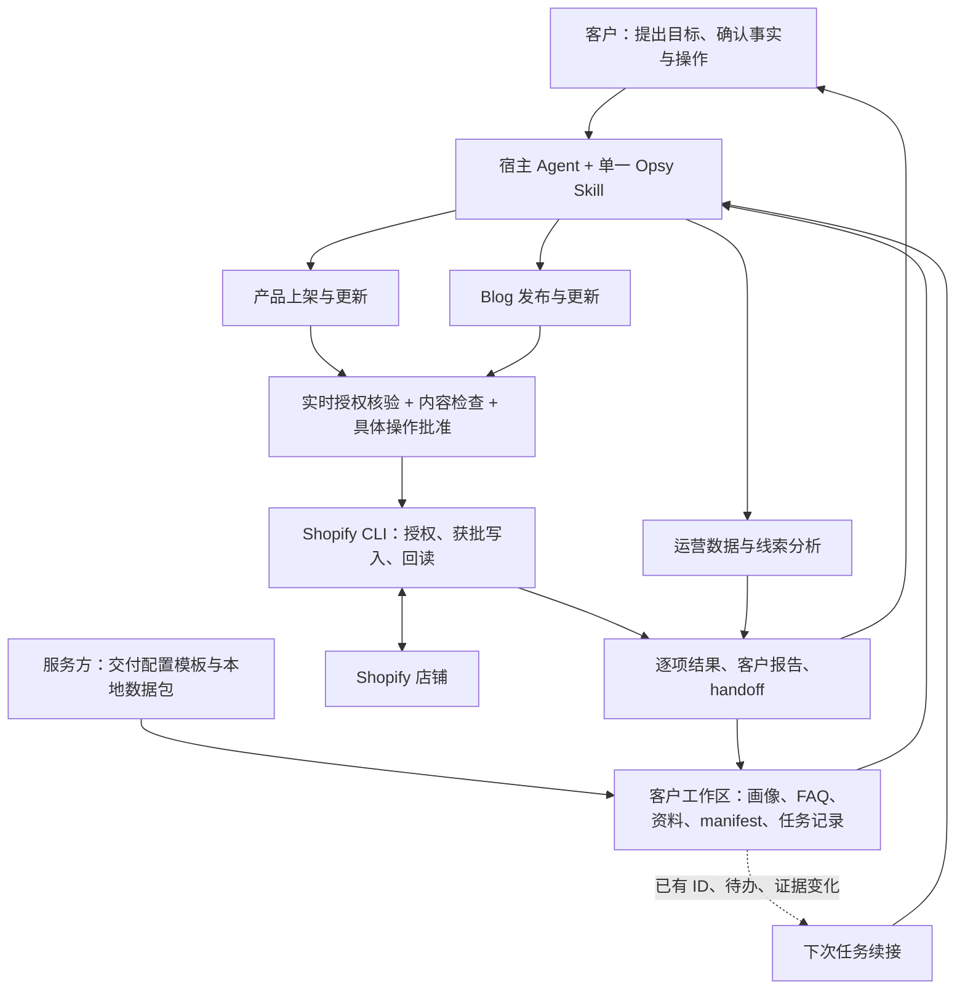
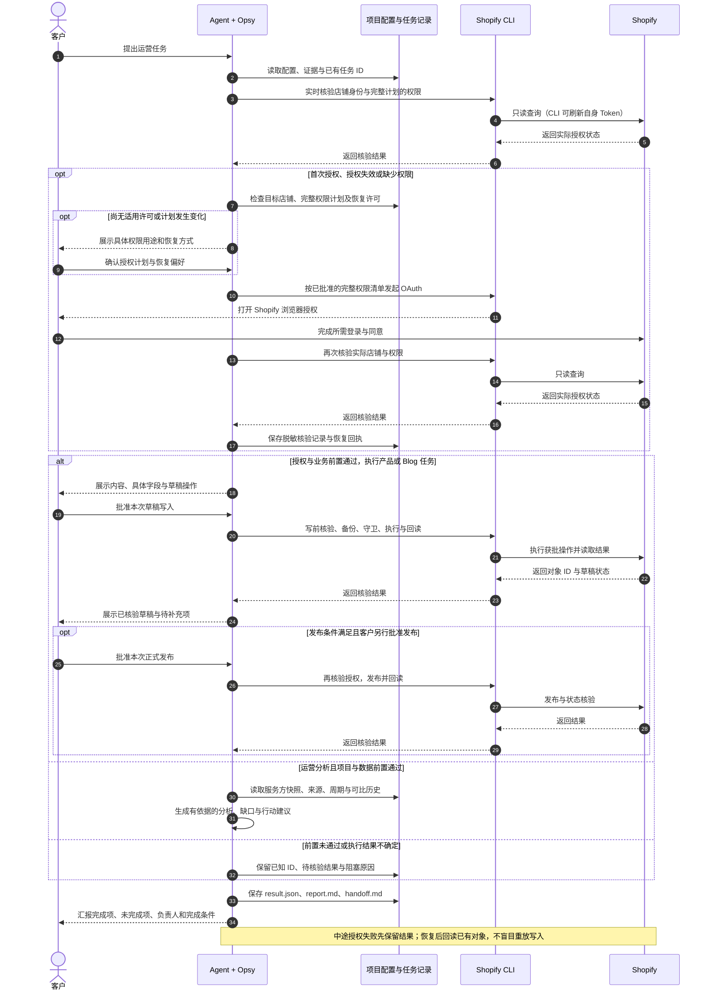

# Opsy — Guided Shopify Operations

**让客户通过一个 Skill Agent，搭配项目配置和服务方数据包，完成产品上架、Blog 发布、运营数据分析。**

Opsy（Shopify 引导式运营助手）面向以询盘、报价和业务联系为目标的 **B2B Shopify 独立站**，兼容 Codex 与 WorkBuddy。客户用自然语言提出需求、确认业务事实和具体操作；Agent 按 Opsy 自带规则与脚本执行，保存结果，让下一次任务能够接着做。

Shopify 操作直接通过 **Shopify CLI** 完成，运行不依赖官方 Shopify 插件、MCP 或其他运营 Skill。仍需宿主 Agent、Node、CLI 和店铺授权；客户资料保留在自己的项目中。

[客户版介绍](docs/opsy-core-purpose.md) · [客户交接 SOP](docs/opsy-customer-handover-sop.md) · [更新日志](CHANGELOG.md) · [授权与恢复](skills/opsy/references/authorization-lifecycle.md) · [结果与交接](skills/opsy/references/result-handoff-contract.md)

交付时可直接复制使用：[客户项目交接清单模板文件夹](docs/templates/customer-handover/README.md)。

## 三项核心功能

| 功能 | 输入 | 完成什么 / 交付什么 |
| --- | --- | --- |
| **产品上架与更新** | 产品规格、图片、销售材料、已确认画像；搜索数据可选 | 整理商品候选，确认受众与页面落点，生成标题、描述、SEO 和询盘引导；按批准内容写入、回读，交付对象 ID、预览链接和待补充清单 |
| **Blog 发布与更新** | 画像、产品知识、FAQ、素材，以及服务方本地数据 | 评估选题，组织正文、FAQ、产品链接、配图和 CTA；生成本地预览，经批准创建草稿、核验并发布，交付结果与证据 |
| **运营数据分析（含线索分析）** | 服务方提供的数据包、manifest 与询盘分析口径 | 分析搜索、页面、渠道及可用询盘数据；在口径可比时做历史对比，交付依据、缺口、结论和下一步行动 |

产品可从已确认的商家材料开始。Blog 优先使用有效 GSC + GA4 本地数据；新站可用有效空数据中心和已接受的 FAQ 问题冷启动，不编造搜索指标。线索分析中，点击或联系意图不等于有效询盘；真实询盘与质量需销售回传确认。

商品支持最低填写模式：核心事实与安全校验通过即可先创建非公开草稿，直接在 Shopify 后台预览；SEO、图片、已有元字段等缺口列入待补充清单，正式发布前补齐。当前变体写入修复覆盖单变体 SKU / 价格，不承诺任意多变体批量编辑。图片上传、Blog SEO 字段写入也需具体批准与回读。

## 配置如何让运营服务 SEO / GEO

三项功能完成动作；配套配置决定为谁做、先做什么、内容放在哪里、如何复盘。

| 配套能力 | 作用 |
| --- | --- |
| 企业与买家画像 | 确认业务模型、目标受众、市场、语言、采购顾虑、卖家语气和询盘入口 |
| FAQ 与业务证据 | 保留问题来源、异议和答案使用资格；搜索需求不能冒充产品事实 |
| 数据配置 | 声明数据文件、来源、周期与时区；缺失指标显示不可用，历史对比先检查口径 |
| 选题评估与落点 | 从数据、FAQ 或商家材料生成候选，确认题目、单页落点和受众卡，再开始写作 |
| 内容与发布检查 | 检查事实、买家价值、SEO 字段、内链、媒体和 CTA；按批准集合执行并核验 |

“题目打分”在当前客户侧实现为**有证据的候选队列、优先级判断与客户确认**，没有独立的关键词难度或机会值数值打分器。SEO / GEO 的目标是内容回答真实问题、表达清晰、事实可追溯；发布完成不代表搜索排名、流量或 AI 引用已经提升，效果需后续数据验证。

配套建站已确认的发布渠道、Blog、市场、语言及元字段定义可以直接复用，减少每次运营重新配置。FAQ 整理、企业画像、本周三件事与 404 处理是辅助入口，共用同一套工作区和执行规则。

## 如何运作

### 架构与数据流

组件与配置总图已同步本轮升级，保留原有配色和 UML 组件框样式。图中包含三项核心功能、CLI 授权恢复、线索与历史数据、写入门和任务续接；点击可查看大图，下方 Mermaid 展开说明执行时序。

[](docs/diagrams/09-opsy-skill-config-dataflow.svg)

[PlantUML 源文件](docs/diagrams/09-opsy-skill-config-dataflow.puml) · [SVG 大图](docs/diagrams/09-opsy-skill-config-dataflow.svg) · [PNG](docs/diagrams/09-opsy-skill-config-dataflow.png)

### 升级补充：核心任务与结果交接



数据分析消费服务方交付的本地快照，不调用 Google OAuth。图中三条业务路径仍受当前项目状态约束；未连接时先完成允许的画像、FAQ、连接和工作区准备。授权由 CLI 管理，Opsy 仅保存权限与核验元数据。

### UML 时序：授权、执行、恢复与交接



以上是新品、新文章的典型流程；已有内容更新同样按具体变更取得批准并核验。网络故障、限流和权限拒绝分别报告，不自动当作 Token 失效反复授权。Mermaid 补充图可在 GitHub 和支持 Mermaid 的 Markdown 阅读器查看；原 SVG 总图继续直接展示，更多图见[图示目录](docs/diagrams/README.md)。当前执行流程以本页和 Skill 引用规范为准。

## 首次使用与授权恢复

在 Codex 或 WorkBuddy 打开客户项目，输入：

```text
使用 $opsy 检查这个项目，并预览运营工作区方案。
```

1. **定位工作区**：读取 `shopify-ops.json`，沿用已有目录与 `AGENTS.md`；新项目先预览再初始化。
2. **确认店铺与权限**：展示商品、Blog、发布渠道、媒体的完整权限计划。客户确认后完成 Shopify 浏览器授权，并选择是否允许以后自动发起同一计划的恢复。
3. **核验并建档**：核验实际店铺身份与已授予权限，补齐画像、角色、语气和业务对象配置。
4. **开展任务**：确认选题与内容，批准具体操作，检查结果并保存交接。续接时读取已有 ID 和变化的证据。

| 状态 | 可以做什么 |
| --- | --- |
| 工作区未建立 | 检查现有项目、预览工作区方案 |
| 店铺连接未完成 | 企业画像问卷、FAQ 资料整理、连接引导、工作区检查 |
| 轻量建档未完成 | 完成档案所需的读取与确认，整理 FAQ |
| 实时授权未核验或需要恢复 | 保留任务和本地资料，完成授权检查；Shopify 写入暂停 |
| 运营写入就绪 | 进入六项菜单；每项写入仍须满足对应能力与批准条件 |

默认计划包含商品、内容、发布渠道、文件的 8 个读写 scope；404 和扩展建档权限按需加入。权限计划改变时需新的确认；**授权同意不等于草稿或发布批准**。

普通 `status` 只检查本地配置，不能证明 Token 有效。运行时入口使用实时核验，失效或缺权限时复用已确认的完整计划发起恢复，再复核实际权限。恢复有单次尝试、超时、同工作区并发锁及失败冷却；浏览器登录与同意仍需人员完成。详见[授权生命周期](skills/opsy/references/authorization-lifecycle.md)。

## 结果如何汇报与交接

每项产品、Blog 或数据任务，包括部分完成和受阻任务，都保留独立记录：

```text
outputs/runs/<task_id>/<run_id>/
  result.json   逐项状态、对象 ID、输入与核验证据
  report.md     面向客户的结果说明
  handoff.md    待办、负责人、完成条件与续接信息
```

报告区分本地准备、Shopify 草稿、已发布与待核验，不将命令退出成功直接当作发布成功。旧记录不覆盖；下一次任务复用对象 ID，检查输入变化。授权中断的回执保存在 `outputs/authorization/`，不保存 Token、Cookie 或原始 OAuth 输出。

## 安装与更新

运行环境：Node.js ≥ 22.12、npm 或其他 Node 包管理器、Git ≥ 2.28，以及 Shopify CLI。仓库工具链基线仍声明 CLI **4.5.2** / Admin GraphQL **2026-07**；本轮授权流程核对使用本机 CLI **4.7.1**。4.5.2 的新流程兼容性与真实店铺 OAuth 尚待实测，详见[授权升级交接](docs/handoffs/2026-09-13-opsy-cli-authorization-handoff.md)。

克隆仓库或解压 Release 后，在仓库根目录执行。安装器自动检测宿主，也支持只选 `Codex` 或 `WorkBuddy`。

**Windows：**

```powershell
.\install.ps1 -Host Both -DryRun
.\install.ps1 -Host Both
```

**macOS / Linux：**

```bash
./install.sh --host both --dry-run
./install.sh --host both
```

更新时先取得所需版本的仓库或 Release，再运行安装器。安装器展示计划并在变更前确认，归档旧 Skill 后安装；客户工作区的画像、资料、数据和结果保持原位。

**同版本源码更新：**当前升级仍在 `0.1.0 / Unreleased`，普通安装可能显示 `up-to-date`。要把审核过的新源码更新到同版本安装副本，需显式使用 `Force`：

```powershell
.\install.ps1 -Host Both -Force -DryRun
.\install.ps1 -Host Both -Force
```

```bash
./install.sh --host both --force --dry-run
./install.sh --host both --force
```

更新后重新加载宿主中的 Opsy，在客户项目执行 `$opsy`，检查状态和已有任务。上述安装命令只安装 Opsy Skill，不代替 Node / Shopify CLI 安装，也不自动完成店铺授权。版本变更见 [CHANGELOG](CHANGELOG.md)。

Windows 中文终端由 helper 在交互模式下切换 UTF-8，JSON 输出采用 ASCII 转义；人读输出仍乱码时可先执行 `chcp 65001`。

## 客户项目与仓库结构

Skill 保存通用方法，客户项目保存经营上下文，两者分开维护。

| 客户文件 / 目录 | 作用 |
| --- | --- |
| 项目根目录 `shopify-ops.json` | 定位运营工作区；已有 `_project/` 可以沿用 |
| 工作区 `config/store-profile.json` | 企业、买家、语言、语气、询盘入口及授权核验元数据 |
| 工作区 `config/buyer_faq.json` | 问题、异议、来源和答案使用资格 |
| 工作区 `data-center/manifest.json` | 声明服务方本地数据包、来源、周期与时区 |
| 工作区 `inbox/`、`outputs/`、`backups/`、`ai-log/` | 输入、产物、写前备份与操作记录 |

新项目默认使用 `shopify-ops/`；已有项目优先保留定位文件、规则和目录。Skill 不复制进客户工作区。详细清单见[项目文件说明](docs/opsy-project-file-inventory.md)。

```text
skills/opsy/       唯一可分发 Skill：规则、引用、模板、Node 脚本
tests/             状态、授权、数据、写入与交接测试
scripts/           仓库校验
docs/              客户介绍、图示、审计与开发交接
VERSION            当前版本标识
opsy-release.json  发布与工具链元数据
CHANGELOG.md        更新日志
install.*          双宿主安装与更新
uninstall.*        可恢复归档卸载
```

## 适用边界与验证状态

Opsy 固定服务 `b2b_inquiry`，以结账成交为主的 DTC 店铺使用独立 Opsy DTC 包。服务商运营套件可交付已审核任务，Opsy 通过本地交接格式导入；该套件是可选上游，三项核心任务、汇报与交接不要求另装其他 Skill。

企业画像限于业务问卷；技术 Tracking、CWV、结构化数据、主题与全站技术审计交由相应实施流程。客户不配置 Google API；已有元字段可按定义填写，不擅自创建定义。

2026-09-13（Asia/Shanghai）的代码验证：**139/139 测试通过**，仓库、Skill、脚本语法与双宿主安装器 dry-run 通过。测试包含合成授权故障与恢复场景，不代表真实店铺 OAuth、图片上传或发布端到端已验收。开发记录见[核心修复交接](docs/handoffs/2026-09-13-opsy-core-repair-handoff.md)与[授权升级交接](docs/handoffs/2026-09-13-opsy-cli-authorization-handoff.md)。

授权实现依据 Shopify 官方 [store auth](https://shopify.dev/docs/api/shopify-cli/store/store-auth) 与[应用授权范围查询](https://shopify.dev/docs/api/admin-graphql/latest/queries/currentappinstallation)核对。运行规则以 [SKILL.md](skills/opsy/SKILL.md) 及其直接引用为准；真实写入前核验所选 API 版本的操作契约。

## 卸载

```powershell
.\uninstall.ps1 -Host Both
```

```bash
./uninstall.sh --host both
```

卸载归档共享的 `opsy` Skill，不扫描或删除客户运营工作区。
