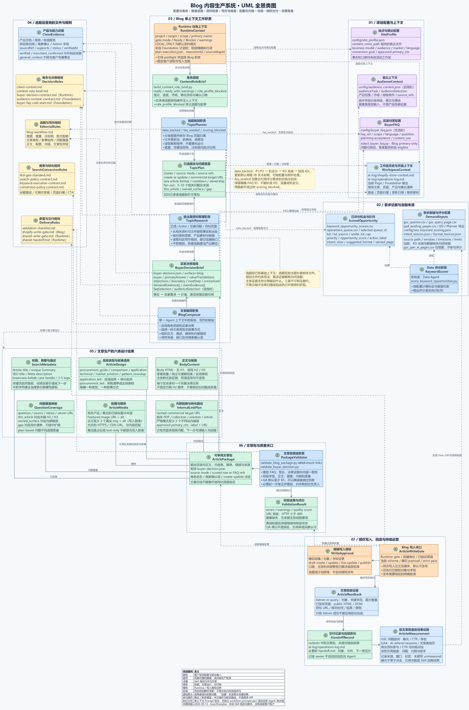

# Blog 内容生产系统 UML 全景图 · 参考资料副本

归档日期：2026-09-13；时区：Asia/Shanghai。按用户要求从知识库复制保存，保留七个分区、33 个概念类。

本图说明 GRC Shopify Operations Skill 的 Blog 内容生产规则，供 Opsy 内容设计与工作流研究参考；它不是 Opsy 当前实现说明，也不作为 Opsy 执行规则。Opsy 实际职责仍以本项目 Skill 与契约为准。

## 查看与使用

- [可缩放、拖动查看页](blog-content-system-class-viewer.html)
- [SVG 矢量图](blog-content-system-class.svg) · [PNG 高清图](blog-content-system-class.png)
- [轻量预览](blog-content-system-class-preview.png)
- [PlantUML 源文件](blog-content-system-class.puml) · [随附样式](_b2b-technical-style.puml)
- [原始来源与验证记录](blog-content-system-class-sources.json) · [本次归档校验](archive-manifest.json)



## 内容与来源

覆盖站点配置、角色简报、评分与 FAQ 两条选题来源、按主题查询资料文件、买家决策、文章类型、正文排版、摘要与描述、媒体、内链、质量校验、精确授权、回读及效果复盘。

权威维护稿保存在知识库：

`F:/website B2B/07_对外传播与案例/02_主题传播/TOPIC-010-资料驱动的Blog内容生产/图示/`

内容依据是本地图示来源记录中的 GRC Skill 规则与脚本；图形参考为 Opsy 的 `09-opsy-skill-config-dataflow.svg`。本次存档没有读取客户账户、修改 Skill 或执行发布。

SVG、PNG、预览、查看页和原始来源 JSON 保持逐字节一致。仅将副本 PUML 的样式 include 改为本目录相对路径，并附带相同样式文件，便于在 Opsy 资料目录独立维护。原始来源 JSON 中的 PUML 摘要对应知识库原件；本地副本摘要见归档校验。

## 重新编译

在本目录运行，使用已有 PlantUML 1.2024.8 和 Microsoft YaHei 字体；`<plantuml.jar>` 替换为本机已安装的工具位置。

```text
java "-Dfile.encoding=UTF-8" "-DPLANTUML_LIMIT_SIZE=12000" -jar <plantuml.jar> -charset UTF-8 -tsvg blog-content-system-class.puml
java "-Dfile.encoding=UTF-8" "-DPLANTUML_LIMIT_SIZE=12000" -jar <plantuml.jar> -charset UTF-8 -tpng blog-content-system-class.puml
```

这里只保存参考快照；后续语义更新优先在知识库维护稿完成，再核对并同步此副本。
