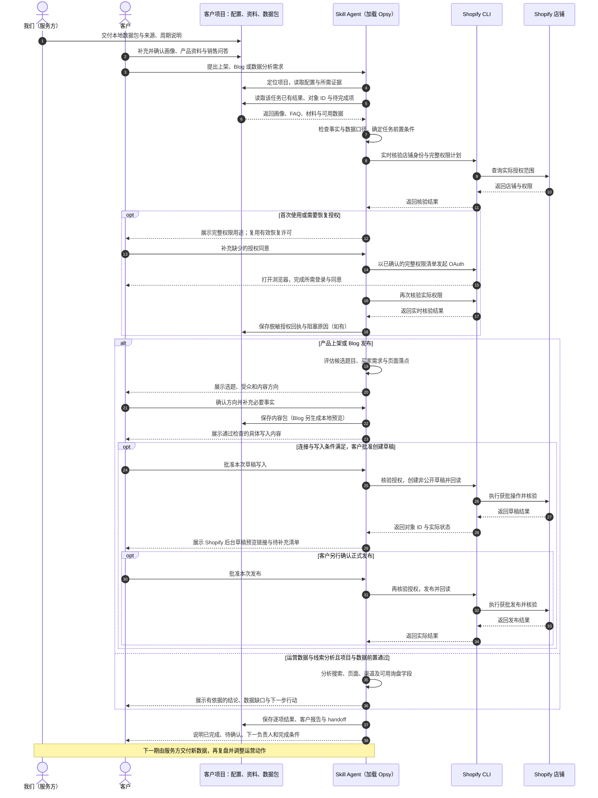

# Opsy 项目核心目的与运作方式

**Opsy 让客户通过 Skill Agent，结合自己的项目配置和我们提供的数据包，完成产品上架、Blog 发布、运营数据分析三项核心工作，让日常运营围绕目标买家的搜索需求与询盘决策持续开展。**

它面向以询盘、报价和业务联系为目标的 B2B Shopify 独立站。客户用自然语言提出需求、补充业务事实并确认结果；Agent 按 Opsy Skill 的方法读取配置、处理资料、生成内容和分析建议，再执行已批准的店铺操作。

## 三个核心功能

| 核心功能 | 客户提供什么 | Opsy 帮客户完成什么 |
| --- | --- | --- |
| **产品上架** | 产品资料、规格、图片，以及已确认的业务事实 | 整理资料，结合买家画像生成商品标题、描述、SEO 字段和询盘引导。按最低填写原则，已确认的核心资料即可先创建非公开草稿，草稿直接在 Shopify 后台预览，同时给出待补充清单（含站点已定义、尚未填写的元字段）；补齐并再次确认后才正式发布。也支持已有商品优化。 |
| **Blog 发布** | 文章需求、产品知识、销售问答与素材 | 结合数据和画像筛选题目，组织正文、FAQ、产品链接、配图和 CTA，生成可预览的文章，确认后发布或更新。 |
| **运营数据分析（含线索分析）** | **我们交付的数据包与询盘分析报表**（含口径说明） | 分析搜索词、页面和渠道表现；询盘漏斗、渠道、国家与 CTA 表现直接采用我们交付的分析口径呈现，客户无需自行总结询盘。归档来源、范围、时区与周期可比时，或已有服务方同期对比表时，提供有界的趋势对比；缺失指标明确显示不可用。 |

线索分析以我们交付的分析口径为准：流量、点击或联系意图事件不能直接当作有效询盘；真实询盘、线索质量与成交情况仍需销售或客服回传后才计入。

## 画像、数据与题目评估为什么必需

三项核心功能负责完成运营动作；配套配置帮助判断**为谁做、先做什么、内容放在哪里、做完怎样复盘**。

| 配套能力 | 在运营中起什么作用 |
| --- | --- |
| **企业与买家画像** | 明确产品业务、目标买家、市场、语言、采购顾虑和表达语气，让产品文案与文章服务同一类客户。 |
| **数据配置** | 声明可用数据文件、来源、日期范围和时区，让 Agent 知道分析依据和缺失项，避免把历史快照说成实时数据。 |
| **FAQ 与业务证据** | 把销售常见问题、采购异议和已确认答案整理为可复用资料，支持产品说明、文章选题和买家决策。 |
| **题目打分与优先级评估** | 结合可用搜索与页面数据、业务匹配度、已有内容和买家问题，判断值得做的主题，并由客户确认本次选题。 |
| **内容落点与发布检查** | 确认主题对应产品页还是 Blog，以及标题、正文、内链和 CTA 如何承接；发布前检查事实、内容和目标对象。 |

这里的“题目打分”指选题评估方法。**当前 Opsy 客户侧实现的是基于证据的候选队列、用途分流和客户确认，不提供独立的关键词难度或机会值数值打分器。**

SEO 指搜索引擎优化；GEO 指面向生成式搜索与 AI 回答的内容优化。Opsy 的设计目标是：让内容回应真实问题、表达清晰、事实可追溯，并关联适当的产品与询盘入口。搜索排名和 AI 引用效果需要后续观测，不能仅凭完成发布认定有效。

## Skill Agent 如何搭配项目配置

**Skill 保存通用运营方法，项目配置保存客户的经营上下文，数据包提供本期分析依据。** Agent 每次执行任务都读取这些材料，客户无需反复从头介绍业务，也无需手写 JSON。

| 项目文件或目录 | 作用 |
| --- | --- |
| `shopify-ops.json` | 定位本项目的运营工作区。 |
| `config/store-profile.json` | 保存已确认的企业、买家、市场、语言、语气、询盘入口和店铺配置。 |
| `config/buyer_faq.json` | 保存经过整理的买家问题、异议及答案的使用资格。 |
| `data-center/manifest.json` 与其声明的数据文件 | 保存我们交付的本地数据快照及其口径。客户无需自行连接 Google API。 |
| `inbox/`、`outputs/`、`ai-log/` | 分别保存输入材料、内容与分析产物、操作结果记录。 |
| `outputs/runs/<任务>/<本次记录>/` | 每次任务保留结果 JSON、客户报告和 handoff；下次接手沿用已有对象 ID，检查资料是否变化。 |
| `outputs/authorization/` | 保存脱敏授权核验与恢复回执；不保存 Token 或 Cookie。 |

除项目根目录的 `shopify-ops.json` 外，上述路径均相对于运营工作区。Opsy Skill 单独安装，客户资料保留在客户项目中。

## UML 运作时序图

下图使用 Mermaid 的 UML 时序图表达，可在支持 Mermaid 的 Markdown 阅读器中查看。

图中展示的是新品、新文章的典型发布路径；已有内容更新也须预览具体变更、取得批准并核验结果。产品可从已确认材料开始；新站没有搜索数据时，Blog 可从已接受的 FAQ 问题冷启动，并明确没有观测到的搜索评分。

三项核心任务及其汇报、交接使用 Opsy 自带规则和脚本，不要求客户另装运营 Skill。运行仍需要宿主 Agent、Node、Shopify CLI、相应店铺权限，以及真实业务材料和服务方数据。上传图片、补写变体或 SEO 字段同样按明确授权执行。

Shopify 操作直接走 CLI，不依赖官方 Shopify 插件。首次连接确认商品、Blog、发布渠道和媒体的完整权限清单；后续授权失效或缺权限时，可按客户已同意的同一计划自动发起恢复。浏览器登录与同意仍需人员完成，恢复后再次核验；网络故障和权限拒绝不会被当作普通授权失效反复重试。授权中断保留任务与对象 ID，续接先回读，避免重复创建。详见[授权与恢复说明](../skills/opsy/references/authorization-lifecycle.md)。

## 客户与我们的分工

- **我们**：交付 Opsy Skill、配套项目配置模板和兼容的数据包，说明数据来源与分析口径。
- **客户**：确认企业与买家画像，提供真实产品和业务材料，选择本次任务并批准具体发布内容。
- **Skill Agent**：复用配置与证据，准备产品和文章、执行分析，完成获批操作并保存结果，支持下一轮复盘。

---

说明日期：2026-09-13，Asia/Shanghai。本文为客户介绍，依据当前仓库的[项目结构](../skills/opsy/references/project-layout.md)、[商品流程](../skills/opsy/references/workflow-products.md)、[Blog 流程](../skills/opsy/references/workflow-blog.md)、[数据分析流程](../skills/opsy/references/workflow-monthly-data.md)和[选题确认规则](../skills/opsy/references/merchant-selection-contract.md)编写；未使用客户实时店铺或经营数据。
